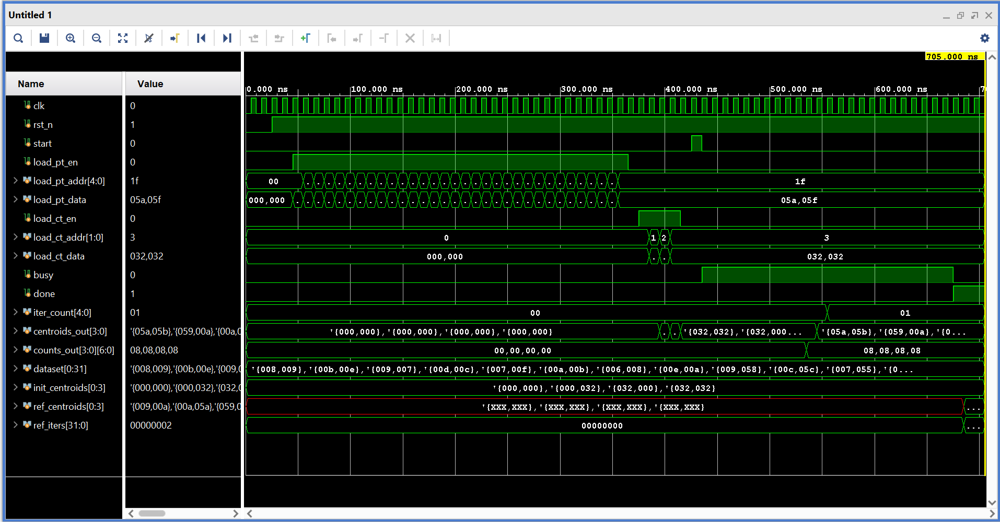

# K-Means Clustering FPGA Accelerator
### A GPU-inspired parallel SystemVerilog datapath implementing Lloyd's algorithm

This project implements a small, parallel **FPGA accelerator** for the
**K-means clustering algorithm** (the "AI/ML" workload). It uses a
**GPU-inspired architecture** — several identical "processing elements"
(lanes) each working on different data points at the same time
(SIMD execution).  

## Key Features

* **Parallel Processing:** Multi-lane architecture for simultaneous
distance computation and centroid update.

* **Verified Design:** Self-checking testbench verified against a
software reference model.

* **Target Toolchain:** Designed, simulated and verified with AMD Vivado.

---

## 1. What it does

K-means clustering repeats two steps until the cluster centers stop moving:

1. **Assign** — every data point is assigned to its nearest centroid
   (by squared Euclidean distance).
2. **Update** — every centroid is moved to the mean of the points
   assigned to it.

This hardware implements exactly that loop (Lloyd's algorithm) as an FSM
driving a small parallel datapath.

## 2. Architecture

```
                         ┌─────────────────────────────────────────┐
                         │              kmeans_top (FSM)            │
                         │                                          │
   point_mem[32] ──┐     │   S_ASSIGN → S_REDUCE → S_UPDATE → S_CHECK│
   (dataset RAM)    │    │        │          │          │        │  │
                     ▼    │        ▼          ▼          ▼        ▼  │
   ┌───────┐  ┌───────┐   │   [PE array]  [reduce]  [centroid   [converged?
   │ lane 0│  │ lane 1│...│                          = sum/cnt]  loop/done]
   │  PE   │  │  PE   │   │
   │  +    │  │  +    │   │  each PE (Processing Element) computes the
   │ accum │  │ accum │   │  squared distance to ALL K centroids in
   └───────┘  └───────┘   │  PARALLEL (one distance_calc per cluster),
                          │  picks the nearest one (argmin), and adds
                          │  the point into its OWN private per-cluster
                          │  sum_x/sum_y/count bank (no write conflicts
                          │  between lanes running at the same time).
                          └─────────────────────────────────────────┘
```

* **NUM_PE parallel lanes** stream through the dataset round-robin
  (lane *p* handles points *p, p+NUM_PE, p+2·NUM_PE, ...*) — this is the
  "GPU" part: multiple lanes, same program, different data, running
  concurrently, similar to SIMT execution.
* Each lane's **distance_calc** units (one per cluster) run in parallel
  too, so a single point is compared against every centroid in one shot.
* Because each lane owns a **private accumulator bank**, there's no
  arbitration/atomics needed while lanes run in parallel — a **reduce**
  stage afterward sums the NUM_PE private banks into the true per-cluster
  totals (a small "map → reduce" pattern).
* The controller alternates **ASSIGN → REDUCE → UPDATE → CHECK** until
  centroids stop moving (or `MAX_ITER` is hit), then asserts `done`.

### File list (compile in this order)

| # | File | Purpose |
|---|------|---------|
| 1 | `rtl/kmeans_pkg.sv`     | Parameters & shared types (edit these to resize the problem) |
| 2 | `rtl/distance_calc.sv`  | Squared-Euclidean-distance unit |
| 3 | `rtl/min_finder.sv`     | Combinational argmin over K distances |
| 4 | `rtl/pe.sv`             | One "GPU lane": K distance units + argmin |
| 5 | `rtl/pe_accum.sv`       | Per-lane private sum_x/sum_y/count accumulator |
| 6 | `rtl/kmeans_top.sv`     | Top level: memory, FSM, PE array, reduce, centroid update |
| 7 | `rtl/kmeans_board_top.sv` | **Optional** — standalone board wrapper: ROM auto-load + button start + ILA debug taps (see §7) |
| 8 | `tb/kmeans_tb.sv`       | **Simulation only** — self-checking testbench for `kmeans_top` |
| 9 | `tb/board_top_tb.sv`    | **Simulation only** — smoke test for `kmeans_board_top` |

### Key parameters (`rtl/kmeans_pkg.sv`)

```systemverilog
DATA_WIDTH = 12   // bits/coordinate (unsigned, 0..4095)
DIM        = 2    // dimensionality (x,y)
K          = 4    // number of clusters
NUM_POINTS = 32   // dataset size (must be a multiple of NUM_PE)
NUM_PE     = 4    // parallel lanes ("GPU cores")
MAX_ITER   = 16   // safety cap on iterations
```

Change these and every module below re-sizes automatically.

---

## 3. Building & simulating in Vivado

### Step 1 — Create the project
1. Open Vivado → **File → Project → New...**
2. Choose **RTL Project**, do **not** specify sources yet (add them next),
   pick any target part (any 7-series/UltraScale part works — this design
   is behavioral and part-independent).

### Step 2 — Add the design sources
1. **Project Manager → Add Sources → Add or create design sources.**
2. Add all 6 files from `rtl/` in this order (order matters less to
   Vivado than to some simulators, but keep them together):
   `kmeans_pkg.sv, distance_calc.sv, min_finder.sv, pe.sv, pe_accum.sv, kmeans_top.sv`
3. When Vivado asks about the file type, make sure it recognizes them as
   **SystemVerilog** (`.sv` extension does this automatically).
4. Set **`kmeans_top`** as the top module for synthesis:
   right-click it in the Sources tree → **Set as Top**.

### Step 3 — Add the testbench (simulation-only source)
1. **Add Sources → Add or create simulation sources.**
2. Add `tb/kmeans_tb.sv`.
3. In the Sources tree, under the **Simulation Sources** group, right-click
   `kmeans_tb` → **Set as Top** (this only affects simulation, not
   synthesis — `kmeans_top` stays the synthesis top).

### Step 4 — Run behavioral simulation
1. **Flow Navigator → Simulation → Run Simulation → Run Behavioral
   Simulation.**
2. Vivado's XSIM will elaborate and run. Watch the **Tcl Console** for:
   ```
   ================ K-MEANS ACCELERATOR RESULT ================
   Hardware converged after 2 iteration(s)
     cluster 0: centroid=(9,10)   points=8
     cluster 1: centroid=(10,90)  points=8
     cluster 2: centroid=(89,10)  points=8
     cluster 3: centroid=(90,91)  points=8

   ---------------- Software reference model ----------------
     cluster 0: centroid=(9,10)
     cluster 1: centroid=(10,90)
     cluster 2: centroid=(89,10)
     cluster 3: centroid=(90,91)

   *** TEST PASSED: hardware matches software reference bit-exact ***
   ```
   The testbench loads a synthetic 32-point dataset (four well-separated
   blobs), deliberately-wrong initial centroid guesses, runs the
   accelerator to convergence, and **cross-checks the hardware result
   against a software Lloyd's-algorithm model** run inside the testbench
   with the exact same integer arithmetic — so a pass here is a real
   correctness check, not just "it didn't crash."

<p align="center">
  
</p>
<p align="center">
  <em>Figure 1: Behavioral simulation waveform showing memory loading, parallel lane activity, and convergence.</em>
</p>


3. In the waveform viewer, useful signals to add: `dut/state`,
   `dut/round_idx`, `dut/iter_count`, `dut/centroids`, `dut/g_count`,
   and any `dut/gen_pe[0].u_pe/*` signal to watch one lane in detail.

4. If the simulation runs long, click the "Run All" ▶ button again or check
   the Tcl console for the `$finish` message.

### Step 5 (optional) — Run synthesis
`kmeans_top` synthesizes standalone (no I/O buffers or clocking wizard
needed for a first pass — Vivado will infer black-box IO). Just:
**Flow Navigator → Synthesis → Run Synthesis**, then check the utilization
report. No constraints file is required to synthesize; add a basic
`create_clock` XDC constraint (e.g. 100 MHz on `clk`) only if you want
timing analysis.

---

## 4. Using your own dataset / centroids

`kmeans_top` exposes a simple load interface so you can drive it from
anywhere (a testbench, a microcontroller, an AXI wrapper you add later):

```
load_pt_en, load_pt_addr, load_pt_data   // write point_mem[addr] = data
load_ct_en, load_ct_addr, load_ct_data   // write centroids[addr] = data (while idle)
start                                     // pulse to begin clustering
busy, done                                // status
centroids_out[K], counts_out[K]           // final result
iter_count                                // iterations actually used
```
Load every point and initial centroid while the FSM is in `S_IDLE`, then
pulse `start` for one cycle.

## 5. Running on real hardware later, via ILA (no board required yet)

`rtl/kmeans_board_top.sv` is a standalone wrapper you can add to the
project right now, ahead of picking a board:

* It hardcodes the same 32-point dataset + initial centroids used by the
  testbench into an internal ROM and auto-loads them into `kmeans_top`
  right after reset — no host PC / testbench needed at runtime.
* A single debounced `start_btn` press (synchronized with a 2-flop
  synchronizer + edge detect) kicks off clustering.
* `led_busy` / `led_done` are plain 1-bit outputs, ready to map to any
  board's LEDs whenever you have one.
* The internal FSM state, iteration count, final centroids, and
  per-cluster counts are all tagged `(* mark_debug = "true" *)` so
  Vivado can wire them straight into an **ILA (Integrated Logic
  Analyzer)** — this lets you watch the design run *on real silicon*
  the same way you watch waveforms in simulation, without needing a
  UART or any custom I/O.

There's also `tb/board_top_tb.sv`, a smoke test that exercises the whole
wrapper (reset → auto-load → button press → result) and confirms it
matches the same answer as the direct-drive testbench.

### To add ILA debug once you're ready to target a board

1. Add `rtl/kmeans_board_top.sv` as a design source and set it as the
   synthesis top (instead of `kmeans_top`) — it instantiates
   `kmeans_top` internally, so no other files change.
2. Add a minimal XDC for your board mapping `clk`, `rst_n`, `start_btn`,
   `led_busy`, `led_done` to real pins (this is the only board-specific
   part — pin names differ per board, but the module itself doesn't).
3. Run Synthesis once normally.
4. **Tools → Set Up Debug...** in Vivado. The wizard automatically finds
   every net tagged `mark_debug` above and lets you insert an ILA core
   with one click, clocked from `clk`.
5. Run Implementation → Generate Bitstream → **Open Hardware Manager**,
   program the device.
6. In Hardware Manager, open the ILA dashboard, set a trigger (e.g.
   `dbg_lstate == L_RUN` or `dbg_done == 1`), and click **Run Trigger**.
   Press the physical start button on the board — you'll see the FSM
   state, iteration count, and final centroids captured live, exactly
   like a simulation waveform but from the real chip.

This means you can develop and fully validate the debug/observability
flow today, and the only thing you'll need to add later is a board-
specific XDC file with the right pin names.

## 6. Design notes / simplifications (worth knowing for a report or viva)

* **Squared distance, no sqrt**: comparing squared distances gives the
  same nearest-neighbor result as comparing true distances, and avoids
  needing a square-root unit entirely.
* **Centroid update uses the `/` operator** (behavioral integer
  division). This keeps the RTL readable and is fine for simulation and
  for Vivado's synthesizer (which infers a divider core); a
  latency-optimized design would replace this with a pipelined divider
  or a reciprocal-multiply approximation — worth mentioning as "future
  work" if this is for a course project.
* **Point memory** is modeled as a simple register-array with a
  synchronous write / combinational read; for large datasets you'd
  switch this to a proper dual-port BRAM (Vivado will infer one
  automatically if you register the read address instead of reading
  combinationally).
* **Packed arrays everywhere** (`type [K-1:0] sig`, not `type sig [K]`)
  were used deliberately for every K-wide / NUM_PE-wide signal — this is
  the most portable, most synthesis-friendly SystemVerilog style, and is
  why this code should drop into Vivado (or any other tool) cleanly.
